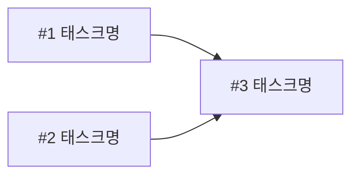

# 5주차 활동지 / Week 5 Worksheet

**1-page 기획서 / One-page plan**

- 작성일 / Date: 2026.09.30
- 참여자 / Present: 정윤지, 김은총, 박강민, 이진호

---

## ① 주제 확정 / Confirm topic

- 확정 주제 / Topic: 도서관 열람실 예약 좌석의 이용 상태를 시각적으로 표시하고, 생성형 AI를 활용해 좌석 이용 정보를 안내하는 스마트 좌석 시스템
- 이유 / Reason: 대학생이 실제로 자주 경험할 수 있는 문제, 사용자 간 직접적인 갈등을 줄일 수 있음

---

## ② 태스크 분해와 의존 관계 / Tasks and dependencies

### 태스크 목록 / Task list

4주차 사용자 스토리와 완료 조건을 태스크로 나눕니다.
*Break down your Week 4 user stories and acceptance criteria into tasks.*

각 태스크는 따로 끝내도 맞는지 확인할 수 있어야 합니다. 담당에 '다 같이'는 쓰지 않습니다.
*Each task must be checkable on its own. Do not write "everyone" as owner.*

| # | 태스크 Task | 완료 조건 Done when | 선행 태스크 Depends on | 담당 Owner |
|---|---|---|---|---|
| 1 | 데이터 구조 설계 | 좌석, 예약 시간, 이용 상태 등을 저장할 데이터 구조가 정의 되있을 때 | 없음 | 김은총 |
| 2 | 좌석 예약 및 상태 관리 | 예약 정보에 따라 좌석의 이용 상태를 확인하고 변경할 수 있을 때 | Task 1 | 정윤지 |
| 3 | LED | 좌석 이용 상태에 따라 LED가 점등/소등될 때 | Task 2 | 박강민 |
| 4 | 화면 | 사용자가 좌석의 예약 및 이용 상태를 화면에서 확인할 수 있을 때 | Task 2 | 정윤지 |
| 5 | AI | 사용자의 질문에 좌석 데이터를 기반으로 이용 정보를 안내할 수 있을 때 | Task 2 | 이진호 |
| 6 | 시스템 통합 및 테스트 | 예약 관리, LED, 화면, AI 기능이 연동되어 정상적으로 동작할 때 | Task 3,4,5 | 박강민 |

### 의존 관계 그래프 / Dependency graph (DAG)

화살표는 "앞 태스크가 끝나야 뒤 태스크를 할 수 있다"는 뜻입니다.
*An arrow means the first task must finish before the second can start.*

**그리는 방법 / How to draw**
- 아래 예시에서 상자 이름을 바꾸고, 선후 관계 하나마다 화살표(`-->`) 줄을 하나씩 추가합니다. GitHub에서 파일을 열면 그림으로 보입니다. 미리 보려면 mermaid.live에 붙여 넣으세요.
  *Rename the boxes and add one `-->` line per dependency. GitHub shows it as a diagram. Preview at mermaid.live.*
- 태스크 표를 AI에게 주고 "Mermaid 그래프로 바꿔 줘"라고 요청해도 됩니다.
  *You can also give the task table to AI and ask "Convert this into a Mermaid graph."*
- 어려우면 종이에 그려 사진을 `docs/images/`에 올리고 ``로 넣어도 됩니다.
  *Or draw it on paper, upload the photo to `docs/images/` and link it with ``.*

- 지금 착수 가능 (진입 차수 0) / Can start now (in-degree 0): 
- 작업 순서 (위상정렬) / Work order (topological sort): 
- 사이클이 있었다면 어떻게 풀었는가 / If there was a cycle, how did you fix it?: 

---

## ③ 범위 결정 / Scope

### Must — 없으면 성립 안 됨 / essential

핵심 시나리오 1개가 끝까지 동작하는 데 필요한 것만 / *Only what the core scenario needs to work end-to-end*
좌석의 예약 상태 확인, 센서를 통한 착석/비착석 감지, LED 등으로 좌석 이용 상태 시각적 표시

- 핵심 시나리오 / Core scenario: 예약된 좌석의 LED가 정상적으로 점등되고, 예약 종료 시 소등되는 기본 루프 구현

### Should (없을 경우에는 작성하지 마세요)
 
 - 시나리오 : 사용자가 계속 좌석을 이용 시 예약 종료 알림등 점멸

### Could (없을 경우에는 작성하지 마세요)

 - 시나리오 : 관리자 폐이지에서 자리 비움 경고 알림, 장시간 비워진 자리는 자동 예약 취소

### **Won't — 이번 학기에 안 함 / not this semester**

| Won't 항목 Item | 포기한 이유 Why |
|---|---|
|  |  |
|  |  |

### 실행 가능성 확인 / Feasibility check

- 특수 장비·유료 API·실제 개인정보가 필요한가? 필요하다면 대안은?
  *Does it need special hardware, paid APIs or real personal data? If so, what is the alternative?*
  --> 아두이노 센서 및 LED활용 예정
- 15주차에 발표장에서 시연할 수 있는 형태인가?
  *Can it be demonstrated live in Week 15?*
  --> 가능함

---

## ④ 가장 먼저 동작시킬 흐름 (Walking Skeleton) / First end-to-end flow

예 / Example: 과제 ID를 입력하면 → LMS에서 제출 기록을 받아 와서 → 화면에 제출 인원 숫자 하나가 뜬다

> [무엇을 입력하면] → [무엇을 처리해서] → [화면에 무엇이 나온다]
> 가상 예약 데이터 생성 → 예약 시작 → 좌석을 사용 중 상태로 변경 → LED 점등 → 예약 시간 종료 → 좌석을 이용 가능 상태로 변경 → LED 소등
> [좌석 번호와 예약 시작·종료 시간을 입력하면] → [예약 정보를 바탕으로 좌석 이용 상태를 판단해서 LED 상태를 제어하고] → [화면에 좌석 이용 상태가 표시되고, 실제 LED가 점등 또는 소등된다.]
---

> 수업 종료 시 커밋하세요 / Commit this at the end of class
> `git add docs/week-05.md && git commit -m "docs: 5주차 활동지 작성"`
